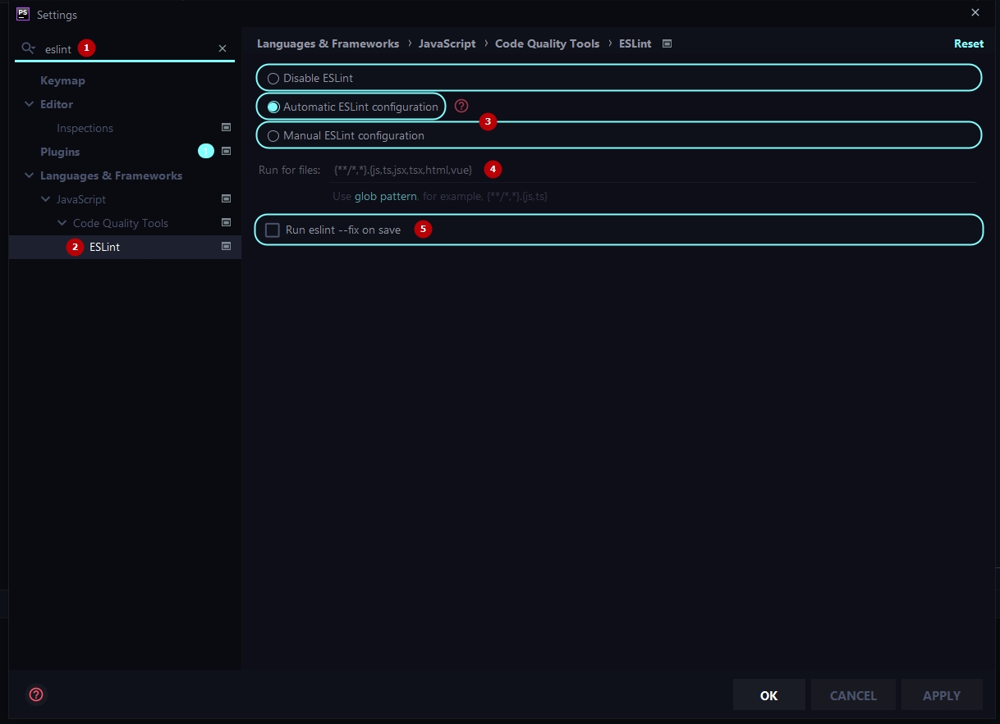

# Настройка Eslint в редакторе

### Структура
1. [Настройка плагина Eslint](#phpstorm)
2. [Правила (плагины)](#правила-plugins)
3. [Полезные ссылки](#полезные-ссылки)

#### PHPStorm
***
### Eslint
ESLint это инструмент, который приводит код к единому стилю, помогает избежать глупых ошибок, умеет автоматически исправлять многие из найденных проблем. 

Плагин Eslint уже имеется в PHPStorm и устанавливать его нет необходимости

Настройка плагина:
1. Найти плагин в поисковой строке
2. Открыть окно настроек
3. Включить автоматический поиск конфигурации eslint (чаще всего этого будет достаточно), если плагин, по каким либо причинам, не сможет найти путь к файлу с настройками, можно указать путь к плагину вручную.
4. Здесь можно добавить в список файлов подпадающих под форматирование определенный формат (зачастую это не требуется, так как изначально все необходимые форматы уже указаны).
5. Отключить запуск eslint fix при сохранении файлов (Важно: если в проекте не используется Prettier эта настройка может быть включена).




#### VSCode
1. [Поставить расширение](https://marketplace.visualstudio.com/items?itemName=esbenp.prettier-vscode)
2. Добавить настройку дефолтного способа форматирования для всего редактора или отдельного языка
```
// для всего редактора 

"editor.defaultFormatter": "esbenp.prettier-vscode",

// для отдельного языка

"[javascript]": {
    "editor.defaultFormatter": "esbenp.prettier-vscode",
},
```
3. Также по желанию можно добавить форматирование при сохранении как для всего редактора, так и для отдельного языка (следуя примеру выше).
```
"editor.formatOnSave": true,
```


#### Правила (plugins)
***
| Keywords          | Description |
| ------            | ------ |
| eslint:recommended  | [Набор базовых правил eslint](https://eslint.org/docs/rules/) |
| vue/recommended  | [Набор правил основанный на официальной руководстве по стилю для Vue-специфичного кода](https://eslint.vuejs.org/rules/) |

### Полезные ссылки
***
-- [Официальное руководство по стилю для Vue-специфичного кода](https://ru.vuejs.org/v2/style-guide/index.html)
