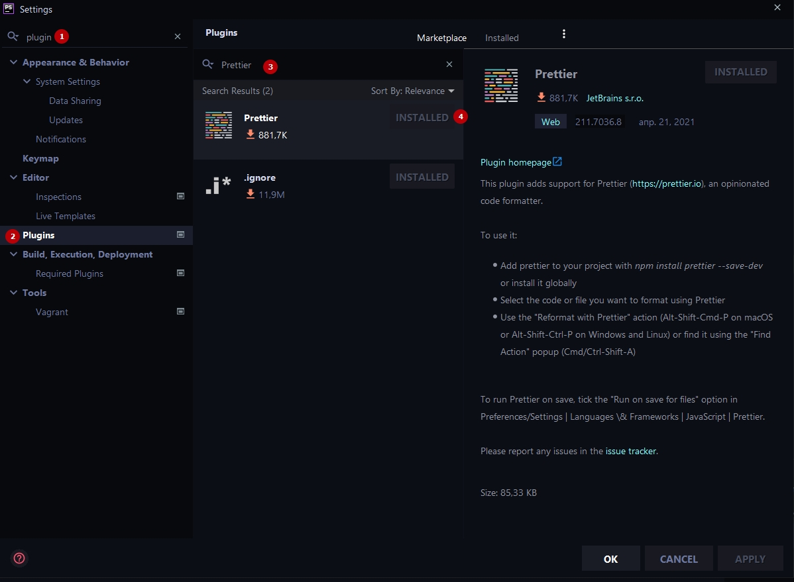
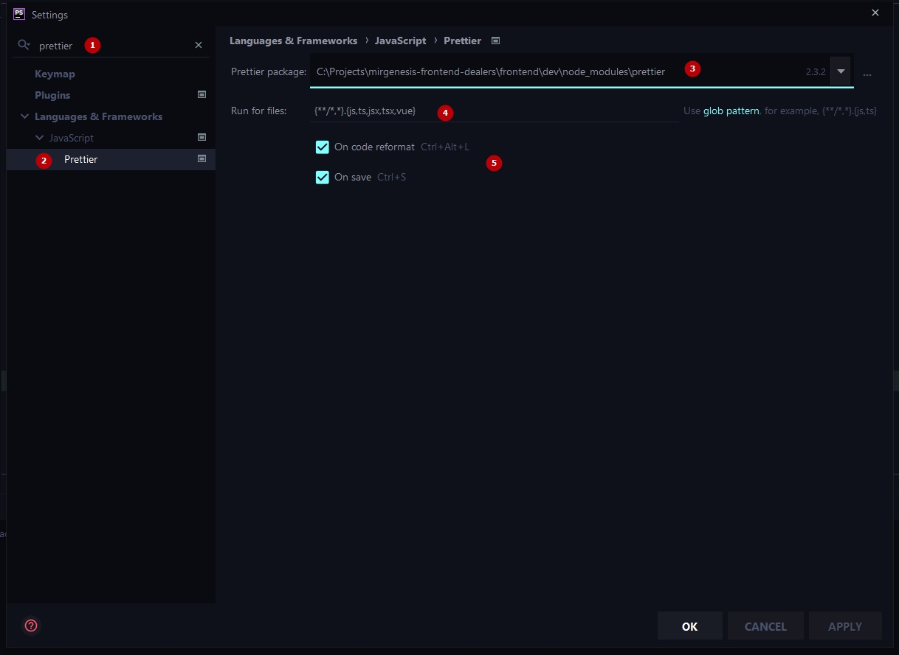

# Настройка Prettier в редакторе

### Структура
1. [Что такое Prettier](#prettier)
2. [Настройка плагина для PHPStorm](#phpstorm)
3. [Правила (плагины)](#правила-plugins)

### Prettier
Prettier - это средство для форматирования кода, которое нацелено на использование жёстко заданных правил по оформлению программ. Важно понимать что prettier не регулирует синтаксис и правила связанные с программированием, лишь визуальное оформление. Синтаксис и правила написания кода по прежнему регулирует ESLint

#### PHPStorm
***
В первую очередь необходимо установить плагин Prettier из Marketplace

А затем активировать его, зайдя в настройки плагина:
1. Найти плагин в поисковой строке
2. Открыть окно настроек
3. Выбрать из выпадающего списка путь к плагину (/node_modules/....)
4. Добавить в список файлов подпадающих под форматирование (*.vue)
5. Включить запуск Prettier при сохранении и форматировании файлов

> ###
> #### VSCode
> ###
> Скоро появится...

#### Правила (plugins)
***
| Keywords          | Description |
| ------            | ------ |
| plugin:prettier/recommended  | [Отключение базовых правил конфликтующих с prettier](https://github.com/prettier/eslint-config-prettier) (конфликтующие правила - это правила отвечающие за визуальное форматирование кода)|
| plugin:prettier-vue/recommended  | [Плагин необходимый для интеграции prettier c Vue-специфичным кодом](https://github.com/meteorlxy/eslint-plugin-prettier-vue) |
| prettier | [Плагин prettier отвечающий за валидацию и форматирование кода](https://prettier.io/docs/en/plugins.html) |
