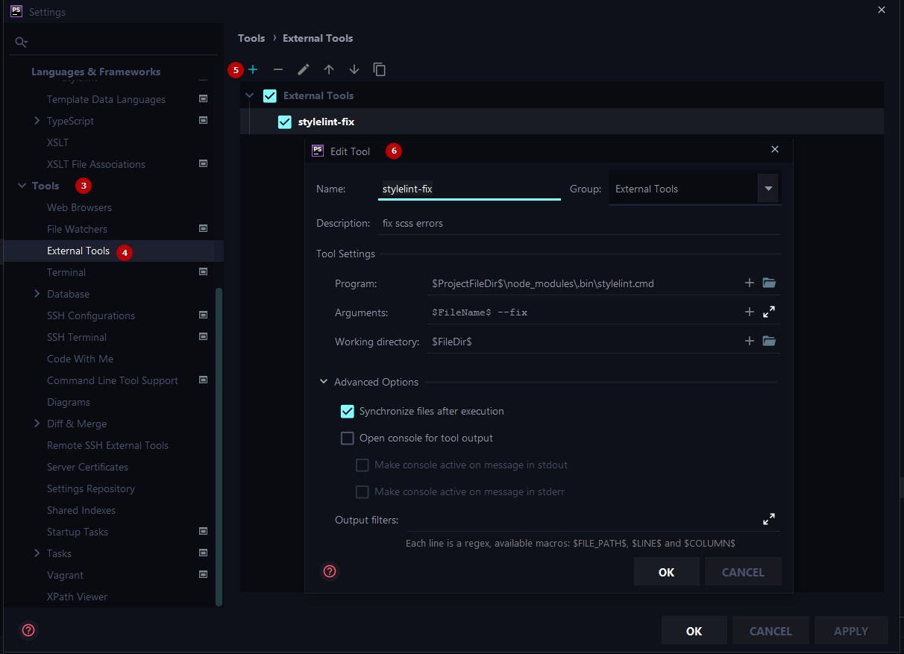
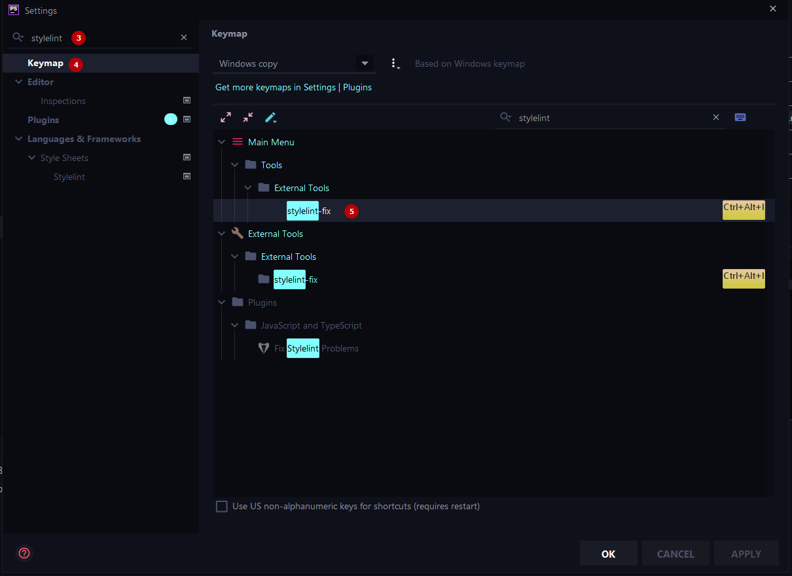
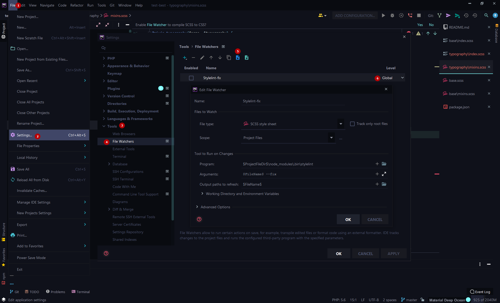
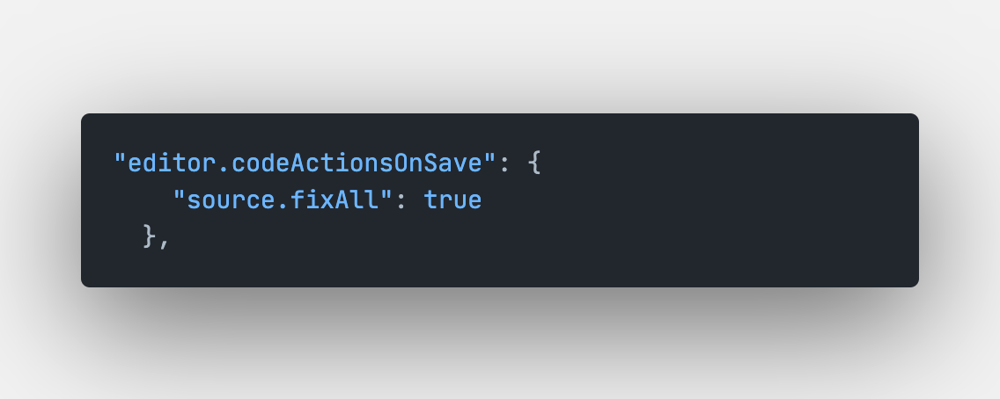

# Настройка Stylelint в редакторе кода

### Структура
1. [Что такое Stylelint external tool](#stylelint)
2. [Настройка плагина в PHPStorm](#добавление-external-tool)
1. [Добавление external tool](#добавление-external-tool)
2. [Добавление keymap](#добавление-ярлыка-keymap-для-этой-команды)
3. [Добавление File Watcher](#добавление-filewatcher-который-будет-следить-за-изменением-файлов-scss)
4. [Последовательность свойств](#последовательность-свойств-orderorder)
5. [Полезные ссылки](#полезные-ссылки)

### Stylelint
Stylelint — это гибкий инструмент для проверки стилей, который не только отлавливает ошибки, но и помогает соблюдать соглашения по стилю кода и применяемым практикам.

#### PHPStorm
***

#### Добавление external tool
1. Вкладка File
2. Пункт Settings (Ctrl + Alt + S)
3. Открыть вкладку Tools
4. Пункт External tools
5. Добавить новый конфиг
6. Вставить следующие строки в поля

| Field name           | code |
| ------------------   | ------ |
| Name                 | `stylelint-fix` |
| Description          | `fix scss errors` |
| Program              | `$ProjectFileDir$\node_modules\.bin\stylelint.cmd` |
| Arguments            | `$FileName$ --fix` |
| Working directory    | `$FileDir$` |



#### Добавление ярлыка keymap для этой команды:
Keymap добавит возможность вызывать 'stylelint --fix' комбинацией клавиш 

***
1. Вкладка File
2. Пункт Settings (Ctrl + Alt + S)
3. написать в поисковую строку stylelint
4. Открыть вкладку Keymap
5. Установить комбинацию

### Важно:
Обратите внимание на вложенность папок от корня проекта к вашим node_modules

Пример: `$ProjectFileDir$\(ваша вложенность)\node_modules\.bin\stylelint.cmd`

| Field name           | code |
| ------------------   | ------ |
| Name                 | `Stylelint-fix` |
| Program              | `$ProjectFileDir$\node_modules\.bin\stylelint.cmd`|
| Arguments            | `$FileName$ --fix` |
| Working directory    | `$FileName$` |



#### Добавление FileWatcher который будет следить за изменением файлов SCSS:

FileWatcher будет автоматически вызывать 'stylelint --fix' после редактирования и сохранения файлов определенного формата (*.scss, *.sass)

***
1. Вкладка File
2. Пункт Settings (Ctrl + Alt + S)
3. Открыть вкладку Tools
4. Пункт File Watchers
5. Импорт конфигурации ([ссылка для скачивания fileWatcher](../assets/watchers/watchers.xml)).
   
   Выберите куда скачать файл с настройками, а затем импортируйте его в PhpStorm как указано на изображении ниже
6. Установить значение global (для всех проектов)

### Важно:
1. После импорта конфигурации проверьте путь к вашим node_modules
2. Редактор кода (PHPStorm) запросит разрешение на выполнение watcher-ов, не пропустите этот момент




#### VS Code
1. [Поставить расширение.](https://marketplace.visualstudio.com/items?itemName=stylelint.vscode-stylelint)
2. В файле настроек добавить следующий код 
```
"editor.codeActionsOnSave": {
   "source.fixAll": true
},
```
<!--  -->


#### Последовательность свойств (order/order)
Пример последовательности свойств - [order-example](../examples/order-example.scss)
***
| Keywords                | Description |
| ------                  | ------ |
| dollar-variables        | $variable: value; |
| custom-properties       | --property: 10px; |
| at-rule                 | @extend .selector; (без вложенности в блок) |
| at-rule @include        | @include mixin; (без вложенности в блок) |
| declarations            | CSS свойства (e. g., display: block) ([stylelint-config-rational-order](https://www.npmjs.com/package/stylelint-config-rational-order)) |
| at-rule @include mixin() {}  | @include mixin() {} (с вложенностью в блок) |
| at-rule @supports       | @supports (display: flex) {} |
| at-rule @include media* | @include media-breakpoint-down(size) {} ([media-breakpoint-documentation](https://getbootstrap.com/docs/5.0/layout/breakpoints/)) |
| at-rule media           | @media (min-width: 1023px) {} |
| at-rules (other @rules) | div { @media () {}, @supports (display: flex) {} } |
| rule (BEM element)      | &__element {} |
| rule (BEM modifier)     | &--modifier {} |
| rules                   | a { span {} }, .selector {} |

### Полезные ссылки
***
-- [stylelint in phpstorm](https://stackoverflow.com/questions/59001918/integration-of-prettier-with-intellij-idea-and-npm)

-- [stylelint-order documentation](https://github.com/hudochenkov/stylelint-order/tree/master/rules/order)

-- [stylelint-config-rational-order documentation](https://github.com/constverum/stylelint-config-rational-order)
